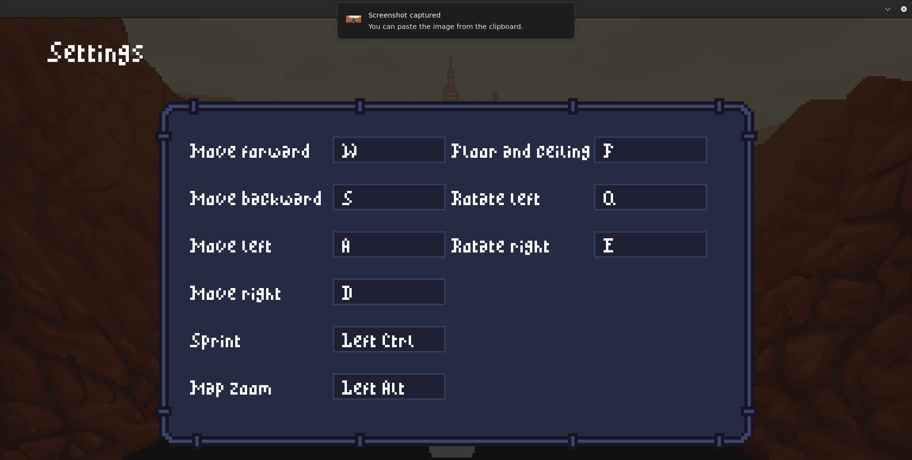
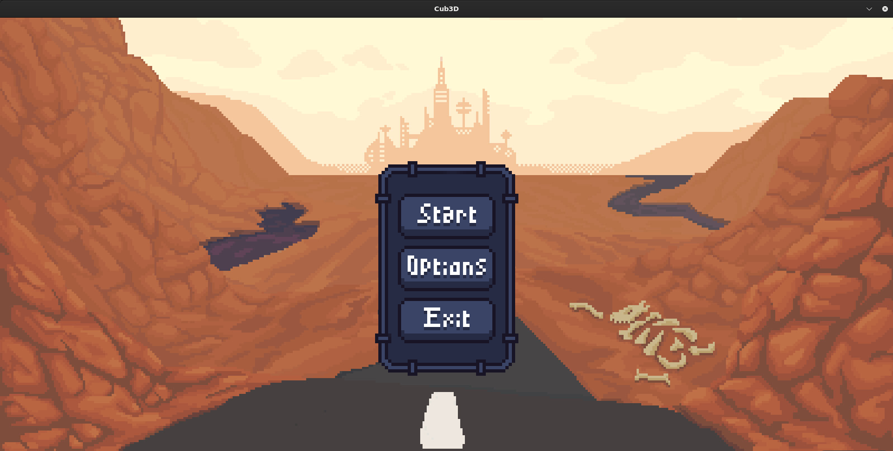
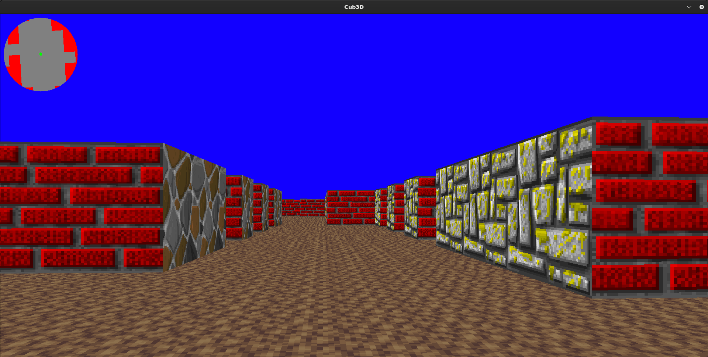
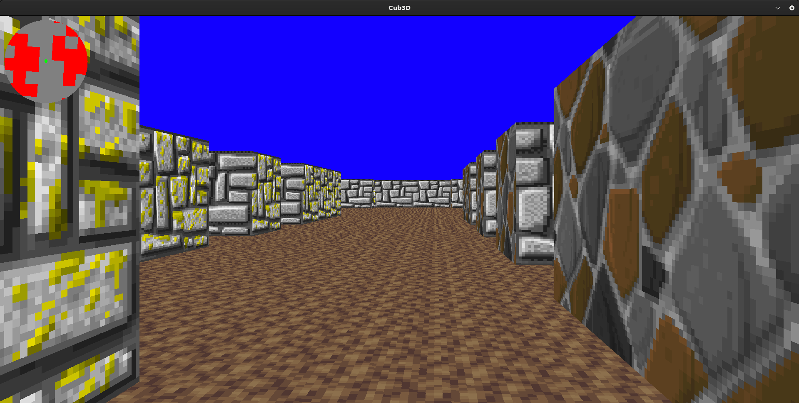

# Cub3d

**Description :**

Cub3D est un projet inspiré du célèbre jeu **Wolfenstein 3D**. Le but est de recréer un moteur de jeu 3D simple utilisant la technique du **raycasting** pour générer un rendu graphique immersif en perspective.
---

### **Usage**
```
make
./cub3D <chemin vers la map>
```
Contrôles (par défaut) :



Fonctionnalités
Moteur Raycasting : Calcul et affichage des murs en 3D.
Support des textures pour les murs, le sol, et le plafond.
Gestion de plusieurs maps grâce aux fichiers .cub.
Système de collisions avec les murs.






Structure des fichiers
Exemple de fichier .cub
Un fichier .cub doit respecter une structure précise pour définir une carte :

```
NO ./textures/north_wall.xpm
SO ./textures/south_wall.xpm
WE ./textures/west_wall.xpm
EA ./textures/east_wall.xpm
F 220,100,0
C 225,30,0

111111
100001
102001
100001
111111
```
